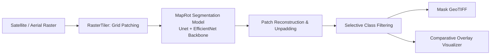

# 🗺️ MapRot: Geospatial Surface Analytics & Semantic Segmentation

[](https://www.python.org/)
[](https://pytorch.org/)
[](LICENSE)
[](#architecture)

**MapRot** is a modular deep learning framework engineered for high-resolution aerial and satellite raster segmentation. Built on PyTorch and modern segmentation backbones, MapRot provides seamless raster tiling, dynamic patch reconstruction, metric benchmarking, and **selective class filtering** for geospatial surface analysis.

---

## 🚀 Key Highlights

* **Modular Python Architecture**: Cleanly decoupled package (`maprot`) separating core utilities, geospatial tiling, model factories, metrics calculation, and execution pipelines.
* **Large Raster Tiling & Reconstruction**: Automated sliding-window tiling with reflective padding and seamless unpatching to process arbitrary-dimension aerial TIFF/RGB rasters without memory overflow.
* **Promptable Selective Filtering**: Train across all land-cover categories, then selectively extract and visualize only target classes of interest (e.g., isolate `building` and `water` while suppressing forest cover).
* **Automated Benchmarking Suite**: Computes per-class and mean Intersection over Union (mIoU), Dice coefficient (F1), Precision, Recall, and outputs structured JSON benchmark reports.
* **Unified CLI & Script Runners**: Run end-to-end workflows via `maprot` CLI or standalone Python scripts.
* **High-Contrast Publication Visualizer**: Automatically generates side-by-side comparative views (Input Imagery, Ground Truth, Segmented Mask, and Alpha-Blended Overlay) with standardized color legends.

---

## 🏛️ Architecture Overview



### Supported Land-Cover Classes
| Class ID | Label | Hex Code | Visual Indicator |
| :---: | :--- | :--- | :--- |
| `0` | **Background** | `#1E1E1E` | Charcoal / Unclassified terrain |
| `1` | **Building** | `#DC322F` | Crimson Red |
| `2` | **Woodland** | `#2ECC71` | Emerald Forest Green |
| `3` | **Water** | `#3498DB` | Azure Blue |
| `4` | **Road** | `#F1C40F` | Amber Gold |

---

## 📁 Repository Structure

```text
e:\maprot/
├── maprot/                     # Core MapRot Framework Package
│   ├── core/                   # System constants, config parser, and logging
│   │   ├── config.py
│   │   ├── constants.py
│   │   └── logger.py
│   ├── data/                   # Dataset loader, geospatial tiling, augmentations
│   │   ├── dataset.py
│   │   ├── tiling.py
│   │   └── transforms.py
│   ├── models/                 # Model factory & checkpoint loader
│   │   └── factory.py
│   ├── evaluation/             # Metrics suite & publication visualizer
│   │   ├── metrics.py
│   │   └── visualization.py
│   └── pipelines/              # End-to-end pipelines (Train, Eval, Predict)
│       ├── trainer.py
│       ├── evaluator.py
│       └── predictor.py
├── configs/
│   └── maprot_default.yaml     # Centralized YAML configuration
├── scripts/
│   ├── train.py                # Standalone training launcher
│   ├── evaluate.py             # Standalone evaluation launcher
│   └── predict.py              # Standalone prediction launcher
├── cli.py                      # Unified CLI entrypoint
├── data/
│   ├── train/                  # Training images & masks
│   └── test/                   # Benchmark test rasters & masks
├── weights/                    # Pretrained & fine-tuned checkpoints (.pth)
├── outputs/
│   ├── predictions/            # Generated prediction GeoTIFFs/PNGs
│   └── plots/                  # Visual comparison & overlay figures
├── logs/                       # Structured execution logs
├── pyproject.toml              # Build & installation specification
├── requirements.txt            # Dependency manifest
└── README.md
```

---

## ⚡ Quick Start

### 1. Installation

Clone and install dependencies within your environment:

```powershell
# Navigate to project
cd e:\maprot

# Install dependencies
pip install -r requirements.txt

# (Optional) Install maprot in editable mode
pip install -e .
```

### 2. Run Inference with Pretrained Weights

Predict on test rasters using the included EfficientNet-Unet checkpoint:

```powershell
python cli.py predict --config configs/maprot_default.yaml
```

Generated outputs will be saved to:
* Binary/Categorical Masks: `outputs/predictions/`
* Side-by-side Visual Plots: `outputs/plots/`

### 3. Selective Class Filtering

Isolate specific classes during inference by providing the `--classes` flag:

```powershell
# Only segment and highlight buildings and water
python cli.py predict --classes building water
```

### 4. Benchmark Model Accuracy

Run evaluation across the test split to compute per-class IoU and Dice scores:

```powershell
python cli.py evaluate --config configs/maprot_default.yaml
```

The benchmark summary is saved to `outputs/benchmark_summary.json`.

### 5. Train a New Model

To train on your custom aerial or satellite data:

```powershell
python cli.py train --config configs/maprot_default.yaml --epochs 30 --batch-size 16
```

---

## ⚙️ Configuration Profile

All parameters are managed centrally inside `configs/maprot_default.yaml`:

```yaml
project_name: "MapRot"
device: "cpu"  # Switch to "cuda" when GPU is available

data:
  file_type: ".tif"
  patch_size: 512       # Window dimensions for sliding tiler
  discard_rate: 0.95    # Filters out uninformative background patches
  batch_size: 16

classes:
  all_classes: ["background", "building", "woodland", "water", "road"]
  train_classes: ["background", "building", "woodland", "water"]
  inference_classes: ["background", "building", "water"]

model:
  arch: "Unet"
  encoder: "efficientnet-b0"
  encoder_weights: "imagenet"
  activation: "softmax2d"
  checkpoint_name: "maprot_unet_efficientnet_b0.pth"

training:
  epochs: 20
  optimizer: "Adam"
  init_lr: 0.0003
```

---

## 💻 Python API Usage

MapRot can also be imported directly into Python applications or Jupyter notebooks:

```python
from maprot.core.config import MapRotConfig
from maprot.pipelines.predictor import MapRotPredictor

# 1. Load configuration
config = MapRotConfig.from_yaml("configs/maprot_default.yaml")

# 2. Initialize Predictor
predictor = MapRotPredictor(config)

# 3. Run prediction with selective classes
results = predictor.predict_directory(
    input_dir="data/test/images",
    selected_classes=["building", "water"],
    save_plots=True
)

print(f"Generated {len(results)} segmentation maps.")
```

---

## 📄 License
This project is licensed under the MIT License.
